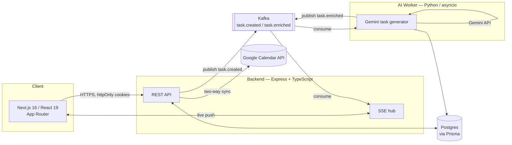

# Automi

**An AI-native scheduling system that plans your calendar around goals, not just events.**

Automi sits on top of Google Calendar and adds a layer Google never built: it lets you define **Periods** (life phases — "Marathon Training", "Exam Prep", "Job Search Q3") and **Recurring Activities** inside them, automatically materializes those into real Google Calendar events on your actual schedule, and uses AI to break every event down into an actionable task — steps, difficulty, time estimate, and success criteria — the moment you create it.

Solo-built, full-stack, event-driven, with a Python/Kafka AI worker running alongside the main API — not a CRUD app with a calendar widget bolted on.

---

## Why not just use Google Calendar?

| | Google Calendar | Automi |
|---|---|---|
| Stores events | ✅ | ✅ (delegates to Google — Google stays source of truth for the event itself) |
| Understands "this is part of a 6-week training block" | ❌ | ✅ — **Periods** group recurring activities under a goal with a start/end date |
| Generates the next 7 days of events from a weekly rule automatically | ❌ (manual recurrence only) | ✅ — a per-day-of-week schedule is expanded into real events on save and topped up on every login |
| Breaks "Leg day" into an actual plan (warm-up steps, difficulty, time, success criteria) | ❌ | ✅ — Gemini generates a structured task for every event, asynchronously, without blocking the UI |
| Tells you live, without refreshing, the moment that AI task is ready | ❌ | ✅ — pushed over Server-Sent Events the instant the AI worker finishes |
| Lets you skip or modify a single occurrence without breaking the rule | ❌ (awkward "this event only" flow) | ✅ — built into the exception model |
| Onboards you into a plan instead of a blank grid | ❌ | ✅ — a 3-step wizard (Welcome → Period → Activities) gets a first working schedule generated before you ever see an empty week |

Google Calendar is the event store. Automi is the planning brain on top of it.

---

## Architecture

Automi isn't a single app — it's three services talking over Kafka, with Postgres as the shared source of truth and Google Calendar as the event mirror.



**Why a separate AI worker instead of calling Gemini inline in the request?** Task generation is a multi-second LLM call. Blocking the "create event" request on it would make the UI feel broken. Instead the backend publishes `task.created` to Kafka and returns immediately; the Python worker consumes it, calls Gemini, validates and coerces the output (LLMs don't reliably return well-typed JSON), writes the result to Postgres, and publishes `task.enriched`. The backend's Kafka consumer picks that up and pushes it to the *specific* user's open SSE connection — the task card updates itself in the browser with no polling, no refresh.

Failure is handled explicitly at each hop: a malformed AI response flips the task to `failed` instead of leaving it stuck on "pending" forever; a Kafka publish failure after a successful DB write does *not* retroactively mark a correct task as failed; a dropped serverless Postgres connection in the AI worker recovers via a connection pool instead of killing the process.

---

## Feature highlights

- **Periods & Recurring Activities** — define a goal-bound time window, attach weekly recurring activities (per-day-of-week start/end times), and the backend expands them into real Google Calendar events for a rolling 7-day materialization window — regenerated on every login and on every edit.
- **AI task breakdown per event** — every event optionally gets a Gemini-generated breakdown: description, step-by-step instructions, difficulty, estimated time, resources, and success criteria, generated asynchronously and delivered live.
- **Two-way Google Calendar sync** — OAuth-based Google login; the app writes events into the user's real Google Calendar and keeps a `SyncedEvent` mapping table so activity edits/deletes correctly patch or remove only the events they created, never touching unrelated events.
- **Real-time updates over SSE** — a per-user connection registry with a 15s heartbeat (so reverse proxies like nginx/Caddy don't kill it as idle) delivers AI results and sync notifications without polling.
- **JWT auth with real revocation** — short-lived (30 min) access tokens plus a 7-day refresh token; a `tokenVersion` counter on the user row is bumped on logout, so a previously issued refresh token is rejected immediately even though its signature is still technically valid — the missing piece in most JWT-only auth setups.
- **Onboarding wizard** — new users go through Welcome → Period → Activities and land on a calendar that's already populated, instead of an empty grid.
- **Drag-and-drop, timezone-correct calendar UI** — built on `react-big-calendar` + `react-dnd`, with custom grid rendering, mobile-specific tap/drawer behavior, and all-day/week/month views; all date math is timezone-aware (events are generated and displayed correctly in the user's own timezone via `date-fns-tz`, not UTC-naively).
- **Event-driven, independently deployable services** — backend, frontend, and AI worker each run and scale independently, connected only by Kafka topics and Postgres.

---

## Tech stack

**Frontend**
- Next.js 16 (App Router), React 19, TypeScript
- Redux Toolkit (global/UI state) + TanStack Query (server state, caching)
- Tailwind CSS 4, Radix UI / shadcn primitives
- `react-big-calendar` (custom-rendered grid) + `react-dnd` for drag-and-drop
- Vitest + Testing Library

**Backend**
- Node.js, Express 5, TypeScript
- Prisma ORM + PostgreSQL (Neon-compatible serverless Postgres)
- Google OAuth 2.0 + Google Calendar API (`googleapis`)
- JWT auth (access + refresh, revocation via token versioning), `helmet`, `express-rate-limit`
- Server-Sent Events for real-time push
- KafkaJS producer/consumer
- Vitest + Supertest, with coverage

**AI worker**
- Python 3.12, `asyncio`, `aiokafka`, `asyncpg`
- Google Gemini (`gemini-3-flash-preview`) with JSON-mode output + manual validation/coercion layer
- Pytest

**Infrastructure**
- Apache Kafka (KRaft mode, no Zookeeper) + Kafka UI via Docker Compose for local dev
- GitHub Actions CI — three parallel jobs (backend, frontend, ai-service), each running typecheck + full test suite; backend tests run against a real Postgres service container, not mocks
- Deploy targets: Vercel (frontend), containerized Node/Python services (backend, AI worker)

---

## Repository layout

```
automi/
├── frontend/         Next.js app (App Router) — calendar, periods, tasks, onboarding
├── backend/           Express API — routes → controllers → services, Prisma schema/migrations
├── ai-service/        Python Kafka consumer — Gemini task generation
├── docker-compose.yml Local Kafka + Kafka UI
└── .github/workflows  CI (backend / frontend / ai-service, run independently)
```

Backend follows a strict `routes → controllers → services` split (routes only wire paths to handlers, controllers parse/shape HTTP, services own business logic and external calls) — enforced by project convention, not just habit.

---

## Running locally

**Prerequisites:** Node 22, pnpm 10, Python 3.12, Docker (for Kafka), a Postgres database, a Google Cloud OAuth client, a Gemini API key.

```bash
# 1. Infrastructure
docker compose up -d          # Kafka + Kafka UI (localhost:8080)

# 2. Backend
cd backend
pnpm install
npx prisma migrate dev
pnpm dev                      # http://localhost:<PORT>

# 3. AI worker
cd ai-service
python -m venv venv && source venv/bin/activate
pip install -r requirements.txt
python main.py

# 4. Frontend
cd frontend
pnpm install
pnpm dev                      # http://localhost:3000
```

Each service needs its own `.env`. Variables referenced in code:

| Service | Variables |
|---|---|
| backend | `DATABASE_URL`, `JWT_SECRET`, `JWT_REFRESH_SECRET`, `GOOGLE_CLIENT_ID`, `GOOGLE_CLIENT_SECRET`, `GOOGLE_REDIRECT_URI`, `FRONTEND_URL`, `KAFKA_BROKER`, `GEMINI_API_KEY`, `PORT` |
| ai-service | `DATABASE_URL`, `KAFKA_BROKER`, `GEMINI_API_KEY` |
| frontend | `NEXT_PUBLIC_API_URL` / `NEXT_PUBLIC_API_BASE_URL` |

## Testing

```bash
cd backend && pnpm test        # Vitest + Supertest, against a real Postgres instance
cd frontend && pnpm test       # Vitest + Testing Library
cd ai-service && python -m pytest -v
```

CI runs all three suites independently on every push and PR (`.github/workflows/test.yml`), including a `tsc --noEmit` typecheck gate for both TypeScript services.

---

## Status

Actively developed, solo project. Recent work: JWT revocation on logout, schema-drift fixes, CI pipeline, expanded backend test coverage, and a pass of mobile calendar UX fixes (toolbar spacing, drawer animation, day-tap behavior).
